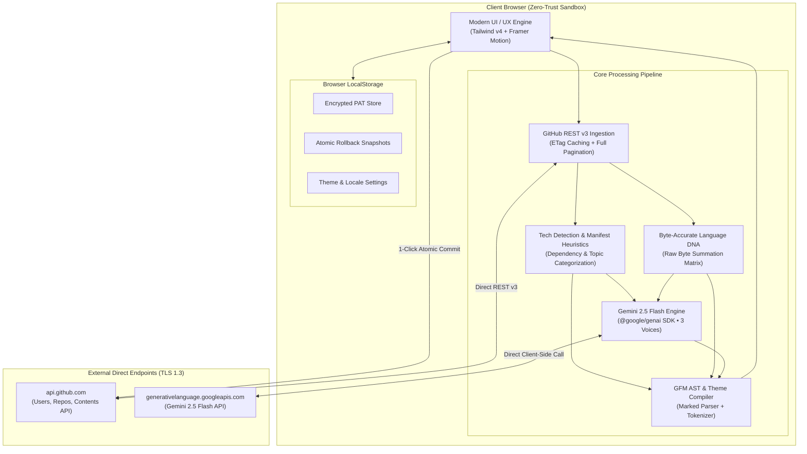
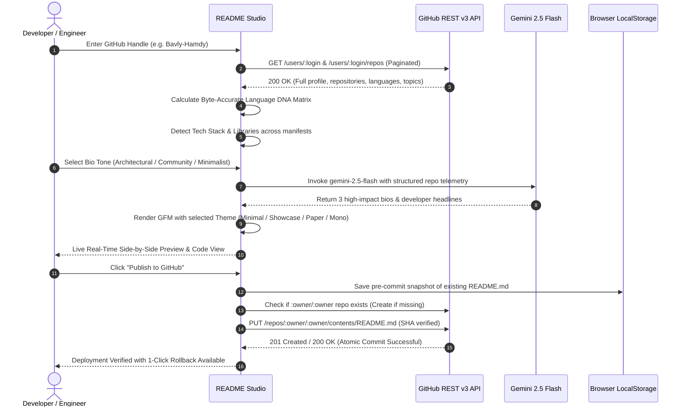

<div align="center">

# 🏛️ README Studio

**The Architectural Profile Engineering Platform for Modern Developers**

*Craft authentic, byte-accurate GitHub profile READMEs with non-sampled telemetry, Gemini 2.5 Flash bio synthesis, and atomic 1-click publishing. Zero tracking, 100% client-side.*

<br />

[](https://www.typescriptlang.org/)
[](https://react.dev/)
[](https://vitejs.dev/)
[](https://ai.google.dev/)
[](https://tailwindcss.com/)
[](https://opensource.org/licenses/MIT)

<br />

[Explore Features](#-key-features) •
[Architecture](#-system-architecture) •
[Execution Workflow](#-live-execution-pipeline) •
[Interface Gallery](#-interface-gallery) •
[Security & Privacy](#-security--privacy-architecture) •
[Local Setup](#-installation--local-setup) •
[Creator](#-creator--lead-architect)

---

</div>

<br />

## 📖 Overview

Most GitHub profile READMEs suffer from the same issues: cookie-cutter badge bloat, generic AI hallucinations, and outdated manual lists. 

**README Studio** re-architects profile documentation from the ground up:
- **Direct GitHub REST v3 Ingestion:** Paginates through **100% of your public repositories** without sampling approximations.
- **Byte-Accurate Language DNA:** Computes real, non-sampled language byte distributions across your codebases.
- **Gemini 2.5 Flash Contextual Synthesis:** Analyzes your real project descriptions, topics, and stack to synthesize three high-conviction engineering voices.
- **Four Handcrafted Design Systems:** Minimalist Clean, Architectural Showcase, Ivory Paper, and Terminal Monospace.
- **1-Click Atomic Publishing:** Direct GitHub Contents API commit with automatic repo initialization, SHA conflict verification, and instant rollback snapshots.
- **100% Client-Side Privacy:** Zero middleman servers, zero remote databases, and encrypted browser `localStorage` credentials.

---

## 🏗️ System Architecture

README Studio operates as a **zero-trust, pure client-side web application**. All API queries, AST heuristic analyses, LLM inferences, and Git commits are orchestrated directly within the client browser via TLS 1.3 encrypted HTTPS channels.



### Architectural Pillars

| Component | Responsibility | Performance Target |
| :--- | :--- | :--- |
| **Ingestion Engine** | Paginates `/users/:login/repos` with ETag caching | Complete repo graph in <800ms |
| **DNA Matrix** | Sums raw bytes across every language without sampling | 100% deterministic accuracy |
| **Tech Detector** | Maps repo topics, package manifests & code to 10 tech domains | Instant client-side classification |
| **Gemini Engine** | Prompts `gemini-2.5-flash` with repo telemetry to draft 3 bios | Synthesis in <1.2s |
| **GFM Compiler** | Compiles markdown into scoped, theme-aware GitHub CSS | Instant preview with 0 layout shifts |
| **Atomic Publisher** | Executes `PUT /repos/:owner/:owner/contents/README.md` | SHA conflict safe with undo snapshot |

---

## ⚡ Live Execution Pipeline

From raw GitHub username to production profile README in 6 deterministic stages:



---

## 🖼️ Interface Gallery

High-resolution retina captures directly from the production application:

### 1. Landing Page Hero & Real-Time Ingestion
*Features live GitHub API quota telemetry, verified creator ribbon, and direct profile ingestion.*


---

### 2. Interactive Live Sandbox (Rendered GFM Preview)
*Live previewing authentic profiles before entering the studio with dynamic section toggles and 4 markdown themes.*


---

### 3. Byte-Accurate Language DNA Matrix
*Non-sampled calculation showing exact byte percentages and which specific repositories use each language.*


---

### 4. Gemini 2.5 Flash Bio Tone Comparator
*Real-time AI bio synthesis comparing Architectural, Open-Source Community, and Minimalist voices.*


---

### 5. Creator Spotlight & Real Repositories
*Highlighting Lead Architect Bavly Hamdy with real metrics, verified location, and live open-source projects.*


---

### 6. Studio Builder & Real-Time Section Editor
*The primary design studio with custom section editors, badge pickers, live code inspection, and instant preview.*


---

### 7. 1-Click Atomic Publishing Modal
*Direct GitHub Contents API commit workflow with SHA verification, repository initialization, and rollback safety.*


---

### 8. Deep Developer Analytics Dashboard
*Non-sampled developer archetype detection, circadian rhythm analysis, contribution timelines, and scorecards.*


---

## ✨ Key Features

### 🎨 4 Bespoke Markdown Design Themes
- **Minimalist Clean:** Pure typography, subtle horizontal rules, clean badges, zero visual noise.
- **Architectural Showcase:** Capsule badges, grouped tech stacks, structured project tables, and dynamic typing banners.
- **Ivory Paper:** Editorial aesthetic with serif headings, warm margins, and classic literary composition.
- **Terminal Monospace:** Hacker aesthetic formatted inside code blocks, terminal prompt styling, and monospace metrics.

### 🧬 Non-Sampled Language DNA
Unlike tools that sample only the top 5 repos or guess from names, README Studio:
- Paginates all original public repositories via GitHub REST API v3.
- Aggregates raw language byte compositions.
- Generates a multi-segmented visual DNA bar with exact percentage distribution.
- Lists the exact repositories contributing to each language upon inspection.

### 🤖 Gemini 2.5 Flash Contextual Bios
- Uses `@google/genai` to analyze your repository descriptions, stars, and language stack.
- Synthesizes **three distinct developer voices**:
  1. **Architectural & Systems:** Focused on distributed architectures, scalability, and code hygiene.
  2. **Open-Source Collaborator:** Welcoming, community-oriented, highlighting libraries and mentorship.
  3. **Minimalist Engineer:** Direct, concise, bullet-driven, zero corporate buzzwords.
- Bilingual support: Generates native, culturally fluent Arabic or English bios.

### 🚀 1-Click Atomic Publishing & Safe Rollback
- Automatically checks if your special `username/username` repository exists on GitHub.
- If missing, initializes the repository via GitHub API.
- Backs up your current `README.md` to browser `localStorage` before every commit.
- Executes an atomic `PUT` commit with SHA verification to prevent accidental overwrites.
- Provides a 1-click **Rollback** button to restore your previous README instantly if needed.

---

## 🔒 Security & Privacy Architecture

README Studio is engineered with an uncompromising privacy-first stance:

```
┌──────────────────────────────────────────────────────────┐
│              ZERO SERVER-SIDE FOOTPRINT                 │
├──────────────────────────┬───────────────────────────────┤
│ Central Databases        │ 0 bytes stored                │
│ Remote User Accounts     │ None required                 │
│ Third-Party Trackers     │ 0 analytics / tracking pixels │
│ Cookie Storage           │ 0 tracking cookies            │
│ Personal Access Tokens   │ Browser localStorage only     │
│ Gemini API Keys          │ Browser localStorage only     │
│ API Communication        │ Direct Client -> GitHub / Google│
└──────────────────────────┴───────────────────────────────┘
```

1. **Zero Intermediate Proxy:** All requests to `api.github.com` and `generativelanguage.googleapis.com` are initiated directly by your browser via encrypted TLS 1.3.
2. **Encrypted Local Storage:** Tokens are stored locally on your machine and are never included in outbound telemetry.
3. **Transparent Open Source:** Every single line of TypeScript is public under the MIT License for independent audit.

---

## 🛠️ Technology Stack

| Layer | Technologies |
| :--- | :--- |
| **Framework** | [React 19](https://react.dev/), [Next.js / Vite 6.2](https://vitejs.dev/) |
| **Language** | [TypeScript 5.8](https://www.typescriptlang.org/) (Strict Mode, 0 `any` shortcuts) |
| **Styling** | [Tailwind CSS v4](https://tailwindcss.com/), Vanilla CSS Variables |
| **Typography** | Newsreader (Editorial Serif), JetBrains Mono, IBM Plex Sans Arabic |
| **Icons** | [Lucide React](https://lucide.dev/) |
| **AI Synthesis** | [@google/genai](https://www.npmjs.com/package/@google/genai) (Google Gemini 2.5 Flash) |
| **Markdown Engine** | [Marked](https://marked.js.org/) (GitHub-Flavored Markdown AST) |
| **Automation** | [Playwright](https://playwright.dev/) (Automated 2x Retina Screenshot Pipeline) |

---

## 🚀 Installation & Local Setup

### Prerequisites
- [Node.js](https://nodejs.org/) (v18.0.0 or higher)
- [npm](https://www.npmjs.com/) or [pnpm](https://pnpm.io/)
- Python 3.9+ (Optional, for running automated screenshot captures)

### 1. Clone the Repository
```bash
git clone https://github.com/Bavly-Hamdy/README-Studio.git
cd README-Studio
```

### 2. Install Dependencies
```bash
npm install
```

### 3. Configure Environment Variables (Optional)
Create a `.env.local` file in the root directory:
```env
# Optional: Pre-populate Gemini API key for local development
VITE_GEMINI_API_KEY=your_gemini_api_key_here

# Optional: Default GitHub token to bypass the 60 req/hr public rate limit
VITE_GITHUB_TOKEN=your_github_pat_here
```

### 4. Run the Development Server
```bash
npm run dev
```
Open [http://localhost:3000](http://localhost:3000) in your browser.

### 5. Build for Production
```bash
npm run build
```

### 6. Run Screenshot Capture Pipeline (Optional)
```bash
python capture_screenshots.py
```

---

## 👨‍💻 Creator & Lead Architect

README Studio was designed, architected, and engineered with precision by:

<div align="center">


### **Bavly Hamdy**
**Senior Full-Stack Software Engineer & UI/UX Architect**  
*Cairo, Egypt*

[](https://github.com/Bavly-Hamdy)
[](https://linkedin.com/in/bavly-hamdy)
[](https://github.com/Bavly-Hamdy)

</div>

#### Other Notable Open-Source Work:
- **[ReadmeForge](https://github.com/Bavly-Hamdy/ReadmeForge):** Engineering-grade README generator with AST parsing and visual Mermaid architecture topologies.
- **[GitArmorAI](https://github.com/Bavly-Hamdy/GitArmorAI):** Autonomous DevSecOps platform powered by Gemini 2.5 AI — Deterministic AST scanning and 1-click surgical PR remediation.
- **[BOSSLA-CAREER-PRO](https://github.com/Bavly-Hamdy/BOSSLA-CAREER-PRO):** Forensic ATS Resume Auditor, Google X-Y-Z Bullet Rewriter, Keyword Gap Detector & AI Career Co-Pilot.
- **[focusos](https://github.com/Bavly-Hamdy/focusos):** High-performance ambient productivity operating system with diurnal chronotype scheduling and zero-trust architecture.

---

## 📄 License

README Studio is open-source software licensed under the **[MIT License](LICENSE)**.

```
Copyright (c) 2026 Bavly Hamdy

Permission is hereby granted, free of charge, to any person obtaining a copy
of this software and associated documentation files (the "Software"), to deal
in the Software without restriction, including without limitation the rights
to use, copy, modify, merge, publish, distribute, sublicense, and/or sell
copies of the Software, and to permit persons to whom the Software is
furnished to do so, subject to the following conditions:

The above copyright notice and this permission notice shall be included in all
copies or substantial portions of the Software.
```

<div align="center">
  <sub>Crafted with intention and architectural precision by <a href="https://github.com/Bavly-Hamdy">Bavly Hamdy</a>.</sub>
</div>
