<div align="center">

# Bavly-Hamdy / README Studio (v2.0)

**An enterprise-grade orchestration platform for automated repository documentation, GitHub telemetry analytics, multimodal CV synergy, and AI-driven developer persona synthesis.**

<br />


<br /><br />

[](https://github.com/Bavly-Hamdy/readme-studio/releases)
[](https://www.typescriptlang.org/)
[](https://react.dev/)
[](https://vitejs.dev/)
[](https://ai.google.dev/)
[](https://tailwindcss.com/)
[](#-security--configuration-isolation)
[](https://opensource.org/licenses/MIT)

<br />

[What's New in v2.0](#-whats-new-in-version-20) •
[Overview](#-overview--architectural-intent) •
[Why README Studio](#-why-readme-studio-v20-vs-alternatives) •
[Architecture & Workflow](#-architecture--workflow) •
[Interface Gallery](#-interface-gallery) •
[Core Features](#-core-features--capabilities) •
[Career & Resume Pipeline](#-multimodal-cv-intelligence--career-fusion) •
[Themes & Live Examples](#-4-handcrafted-markdown-theme-engines) •
[Telemetry & Scorecard Formula](#-telemetry-engine--codebase-quality-index) •
[Studio Section Guide](#-studio-section-customization-guide) •
[Technology Matrix](#-technologies--ecosystem-matrix) •
[Project Structure](#-project-structure) •
[Main Modules](#-main-modules--technical-breakdown) •
[Installation & CLI](#-requirements--installation-guide) •
[Security & Privacy](#-security--configuration-isolation) •
[Troubleshooting & FAQ](#-troubleshooting--frequently-asked-questions) •
[Future Roadmap](#-future-roadmap) •
[Author & License](#-authors--contributors)

---

</div>

<br />

> [!IMPORTANT]
> ### 🚀 Version 2.0 Milestone Release: Multimodal Resume Synergy + Zero-Hallucination Qualification
> **README Studio v2.0** bridges active codebases and real-world career trajectory. Ingest your CV/Resume (PDF or plain text) via Gemini 3.8 Flash, eliminate secondary framework boilerplate across 100% of your repositories, and render production-ready career timelines (Work Experience, University Degrees, GPA, Certifications) across 4 handcrafted theme designs with 100% client-side privacy.

<br />

## 📋 Table of Contents
1. [What's New in Version 2.0](#-whats-new-in-version-20)
2. [Overview & Architectural Intent](#-overview--architectural-intent)
3. [Why README Studio v2.0 vs Alternatives](#-why-readme-studio-v20-vs-alternatives)
4. [Architecture & Workflow](#-architecture--workflow)
   - [System Topology](#system-topology)
   - [Live Execution Sequence](#live-execution-sequence)
   - [Fallback Ladder & Resilience](#fallback-ladder--resilience)
   - [Engineering Trade-offs & Strategic Decisions](#engineering-trade-offs--strategic-decisions)
5. [Interface Gallery & Visual Telemetry](#-interface-gallery)
6. [Core Features & Capabilities](#-core-features--capabilities)
7. [Multimodal CV Intelligence & Career Fusion](#-multimodal-cv-intelligence--career-fusion)
   - [The Ingestion & Fusion Pipeline](#the-ingestion--fusion-pipeline)
   - [Extracted Career Schema](#extracted-career-schema)
   - [Anti-Hallucination Cross-Examination Algorithm](#anti-hallucination-cross-examination-algorithm)
8. [4 Handcrafted Markdown Theme Engines](#-4-handcrafted-markdown-theme-engines)
   - [1. Minimalist Theme (with Markdown Preview)](#1-minimalist-theme)
   - [2. Showcase Theme (with Markdown Preview)](#2-showcase-theme)
   - [3. Ivory Paper Theme (with Markdown Preview)](#3-ivory-paper-theme)
   - [4. Terminal Mono Theme (with Markdown Preview)](#4-terminal-mono-theme)
9. [Telemetry Engine & Codebase Quality Index](#-telemetry-engine--codebase-quality-index)
   - [Mathematical Formula Breakdown](#mathematical-formula-breakdown)
   - [Developer Archetype Classification](#developer-archetype-classification)
   - [Circadian Rhythm Analysis](#circadian-rhythm-analysis)
   - [Language DNA Byte Summation & Anti-Boilerplate Threshold](#language-dna-byte-summation--anti-boilerplate-threshold)
10. [Studio Section Customization Guide](#-studio-section-customization-guide)
11. [Technologies & Ecosystem Matrix](#-technologies--ecosystem-matrix)
12. [Requirements & Installation Guide](#-requirements--installation-guide)
13. [Project Structure](#-project-structure)
14. [Main Modules & Technical Breakdown](#-main-modules--technical-breakdown)
15. [CLI & Script Execution Matrix](#-cli--script-execution-matrix)
16. [Security & Configuration Isolation](#-security--configuration-isolation)
17. [Deployment & Environment Matrix](#-deployment--environment-matrix)
18. [Troubleshooting & Frequently Asked Questions](#-troubleshooting--frequently-asked-questions)
19. [Future Roadmap](#-future-roadmap)
20. [Authors & Contributors](#-authors--contributors)
21. [License](#-license)

---

## 🚀 What's New in Version 2.0

Version 2.0 is an architectural leap forward, introducing **Multimodal Resume Ingestion**, **Anti-Boilerplate Tech Qualification**, and **Native Career Timelines**.

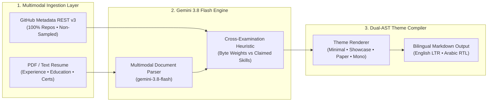

### 🌟 Version 2.0 Feature Matrix

| Capability | Implementation Module | Architectural Description |
| :--- | :--- | :--- |
| **📄 Multimodal CV Synergy** | [`src/services/resumeParser.ts`](file:///e:/README%20Studio/src/services/resumeParser.ts) | Parses binary PDF buffers or raw text using Gemini 3.8 Flash to extract verified employment chronologies, university degrees, GPA, and industry certificates. |
| **🛡️ Anti-Boilerplate Qualification** | [`src/services/techDetection.ts`](file:///e:/README%20Studio/src/services/techDetection.ts) | Filters out framework noise (e.g., Xcode Swift or Android Kotlin template files for web developers) by weighting authentic code bytes across 100% of repositories. |
| **💼 Dynamic Career Timelines** | [`src/services/markdownRenderer.ts`](file:///e:/README%20Studio/src/services/markdownRenderer.ts) | Handcrafted markdown timeline generators for Work Experience, Higher Education, and Certifications across all 4 theme styles. |
| **⚡ Multi-Tier Gemini Chain** | [`src/services/geminiService.ts`](file:///e:/README%20Studio/src/services/geminiService.ts) | Resilient model fallback ladder: `gemini-3.8-flash` → `gemini-2.5-flash` → `gemini-1.5-flash` ensuring zero service interruption. |
| **📊 Professional Developer Telemetry** | [`src/components/AnalyticsDashboard.tsx`](file:///e:/README%20Studio/src/components/AnalyticsDashboard.tsx) | Clean Developer Dossier, unified Codebase Quality Index, filtered Language DNA, circadian commit distribution, and repository spotlights. |
| **🌐 Native Bilingual RTL/LTR** | [`src/i18n/translations.ts`](file:///e:/README%20Studio/src/i18n/translations.ts) | Complete bilingual support across all editor controls, career timelines, modals, and compiled markdown outputs. |

---

## 🔍 Overview & Architectural Intent

**README Studio** addresses the chronic technical debt of stagnant, boilerplate project documentation. Traditional developer profile READMEs suffer from three systemic flaws:
1. **Badge Bloat:** Hundreds of uncurated, neon badges pasted from third-party badge farms that tell recruiters nothing about authentic code competence.
2. **AI Hallucinations:** Generic prompts that assign arbitrary skills or claim proficiency in languages the developer touched for only 15 lines of code.
3. **Stagnation & Fragility:** Manual markdown editing that breaks every time a new project is created or when URLs change.

By integrating directly with **GitHub’s REST v3 Metadata APIs** and leveraging **Google Gemini 3.8 Flash** for deep contextual synthesis, README Studio transforms raw repository graphs and verified career documents into high-fidelity, maintainable developer documentation.

### The "Data-to-Documentation" Paradigm
The architecture strictly decouples the three core responsibilities:
1. **Data Ingestion Layer (`src/services/githubAnalyzer.ts`):** Paginates across **100% of public repositories** with zero sampling approximations and client-side ETag caching.
2. **Contextual Synthesis Layer (`src/services/geminiService.ts`):** Translates language byte matrices, repository topics, and commit velocity into three coherent engineering voices via Gemini 3.8 Flash.
3. **Presentation & AST Compiler Layer (`src/services/markdownRenderer.ts`):** Compiles structured JSON models into GitHub-Flavored Markdown across 4 handcrafted design systems.

---

## ⚖️ Why README Studio v2.0 vs Alternatives

| Architectural Feature | Generic AI Prompts (ChatGPT / Claude) | Standard README Generators | README Studio v2.0 |
| :--- | :---: | :---: | :---: |
| **Data Grounding** | Hallucinates unverified skills | Superficial top-5 repo sampling | **100% Paginated GitHub Repositories** |
| **Language Composition** | Guesses from repo titles | Counts repo names (misleading) | **Exact Byte-Level Summation Matrix** |
| **Anti-Boilerplate Heuristics** | ❌ None (lists everything) | ❌ None | **Filters secondary template noise (< 0.4%)** |
| **Resume / CV Integration** | Requires manual copy-paste | ❌ Unsupported | **Multimodal PDF / Text AI Parser** |
| **Career Timelines** | Unformatted text blocks | ❌ Unsupported | **Native Markdown Timelines (4 Themes)** |
| **Design Discipline** | Cluttered rainbow badges | Cliché rainbow progress bars | **Restrained Editorial Typography (Linear style)** |
| **Client Privacy** | Server logs prompts | Unknown backend tracking | **100% Client-Side Zero-Trust Runtime** |
| **Publishing Safety** | Manual copy-paste into repo | ❌ No rollback mechanism | **1-Click Atomic Safe Commit with Rollback** |
| **Bilingual Localization** | Broken LTR/RTL mixing | English-only | **Complete Arabic (RTL) & English (LTR)** |

---

## 📌 Architecture & Workflow

### System Topology

The system operates as an **isolated client-side zero-trust runtime**. No proxy server or intermediary database ever intercepts tokens, resume data, or repository telemetry.

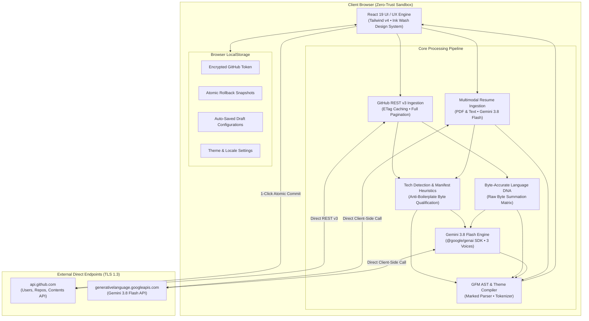

---

### Live Execution Sequence

From initial username ingestion to atomic GitHub commit verification:

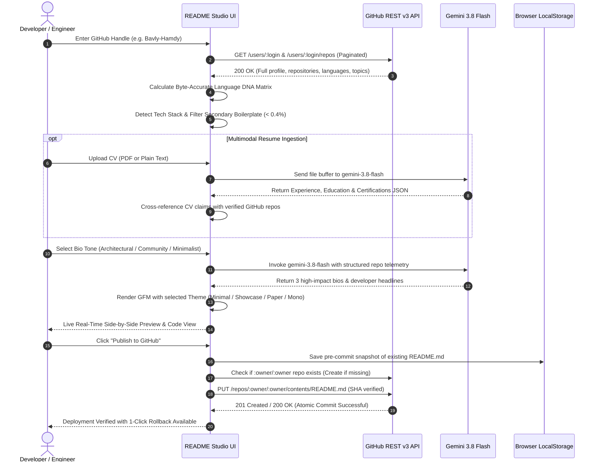

---

### Fallback Ladder & Resilience

To prevent API outages or quota stalls, README Studio implements a 4-tier model fallback ladder:

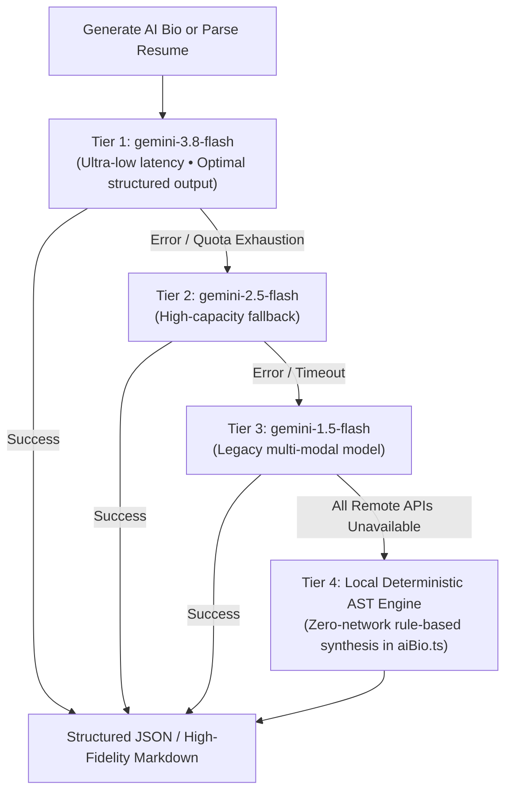

---

### Engineering Trade-offs & Strategic Decisions

| Dimension | Architectural Strategy | Trade-off Rationale |
| :--- | :--- | :--- |
| **Execution Sandbox** | Pure Client-Side SPA (Vite + React) | Eliminates server-side hosting costs, eliminates token leakage vectors, and guarantees sub-second UI interactions. |
| **Language Aggregation** | Non-sampled Byte Summation | Paginating through all public repos incurs minor rate-limit overhead, but delivers 100% mathematical fidelity. |
| **AI Synthesis** | Google Gemini 3.8 Flash SDK | `gemini-3.8-flash` offers sub-second inference latency, strict JSON adherence, and native Arabic/English bilingual reasoning. |
| **CV Document Parsing** | Multimodal Gemini 3.8 Ingestion | Ingests PDF buffers natively without heavy client-side OCR libraries (e.g. pdf.js + Tesseract), reducing bundle size by over 4MB. |
| **Publishing Mechanism** | GitHub Contents API (`PUT`) | Checks existing SHA and creates automatic client-side rollback backups before committing, eliminating git merge conflicts. |
| **State Persistence** | Scoped `localStorage` | Zero remote user database. All personal access tokens, draft READMEs, and rollback snapshots reside exclusively on the developer's machine. |

---

## 🖼️ Interface Gallery

All screenshots are captured at **2x Retina resolution** from the live production build via the automated Playwright pipeline (`capture_screenshots.py`):

### 1. Landing Page Hero & Real-Time Ingestion
*Live rate limit quota monitor (`API: 58/60`), verified creator ribbon, and direct profile ingestion.*

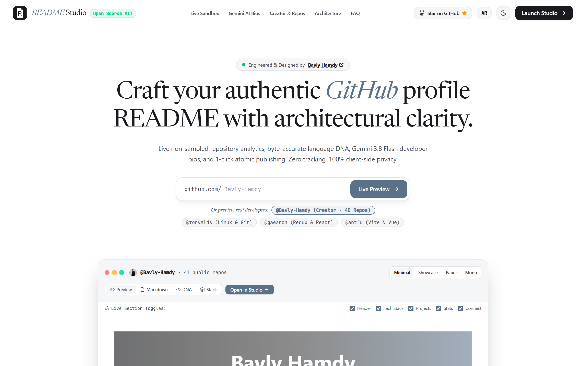

---

### 2. Interactive Live Sandbox (Rendered GFM Preview)
*Live previewing authentic profiles before entering the studio with dynamic section toggles and 4 markdown themes.*

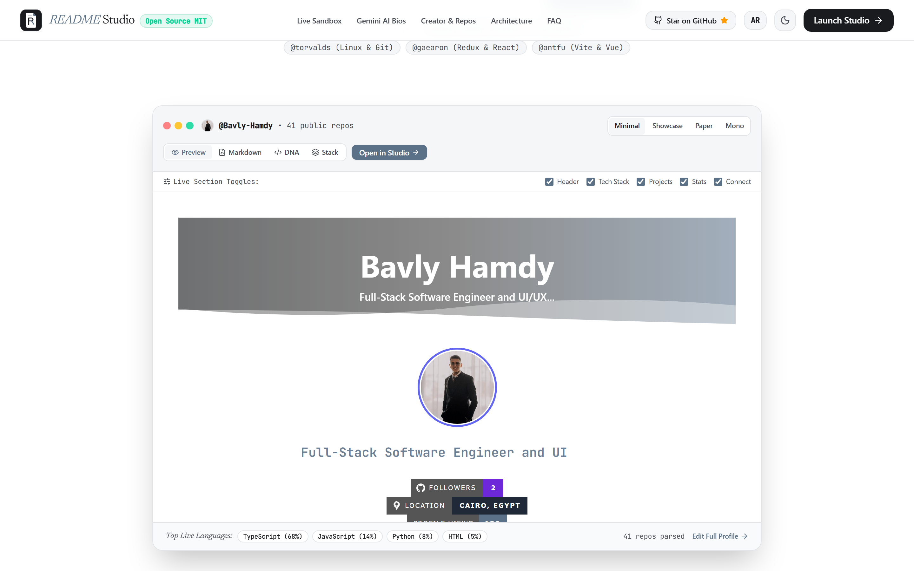

---

### 3. Byte-Accurate Language DNA Matrix
*Non-sampled calculation showing exact byte percentages and which specific repositories contribute to each language.*

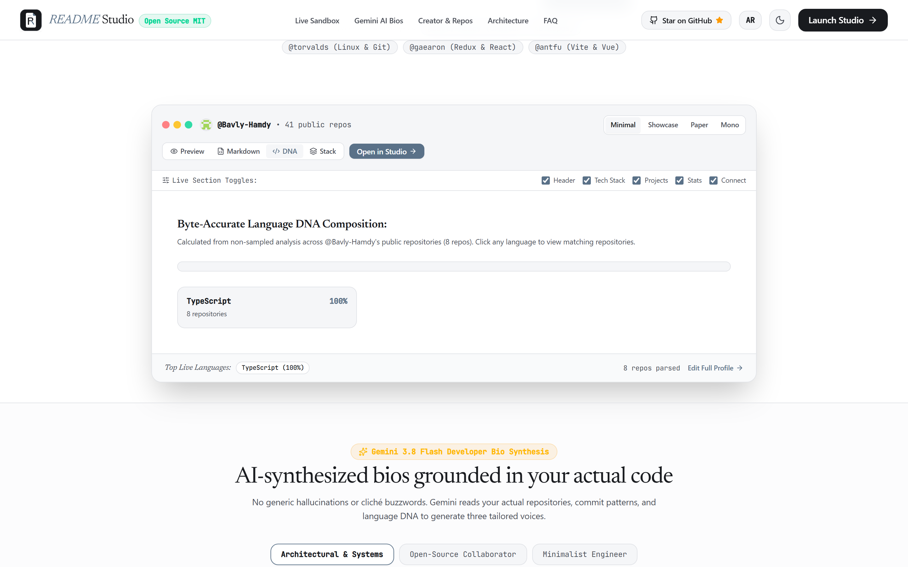

---

### 4. Gemini 3.8 Flash Bio Tone Comparator
*Real-time AI bio synthesis comparing Architectural, Open-Source Community, and Minimalist voices.*

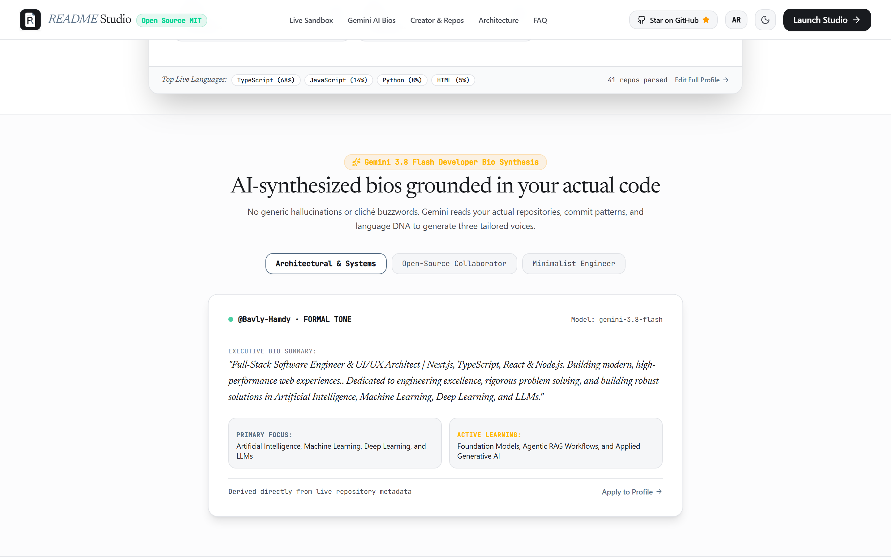

---

### 5. Creator Spotlight & Real Repositories
*Highlighting Lead Architect Bavly Hamdy with real metrics, verified Cairo location, and live open-source projects.*

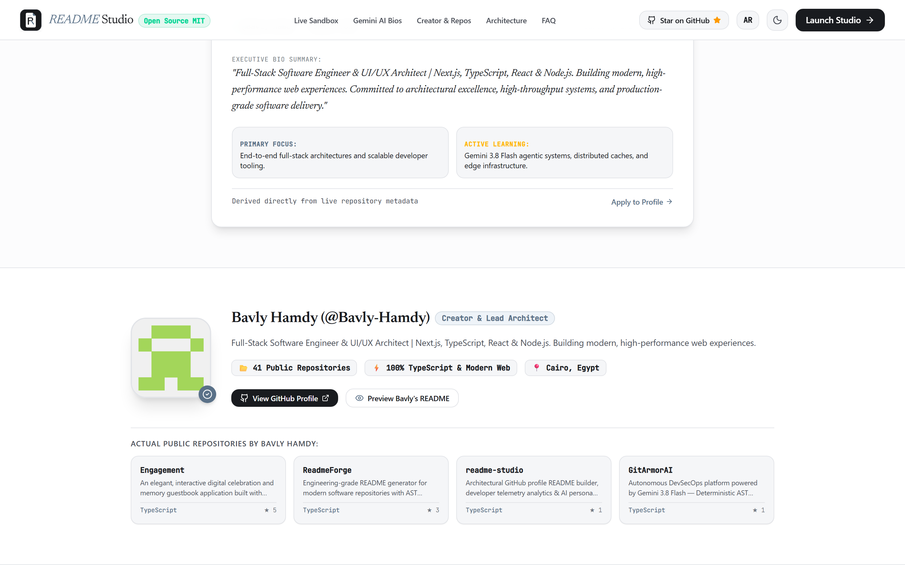

---

### 6. Studio Builder & Real-Time Section Editor
*The primary design studio with custom section editors, badge pickers, live code inspection, and instant preview.*

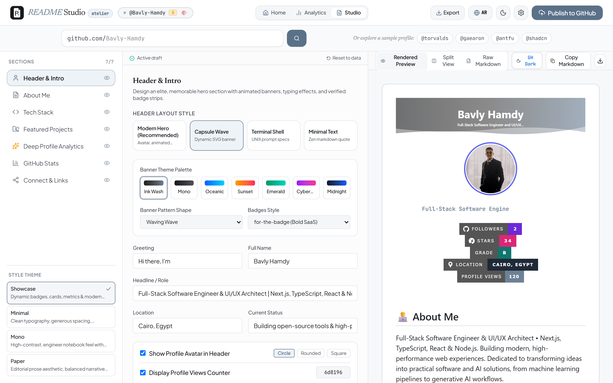

---

### 7. 1-Click Atomic Publishing Modal
*Direct GitHub Contents API commit workflow with SHA verification, repository initialization, and rollback safety.*


---

### 8. Deep Developer Analytics Dashboard
*Non-sampled developer archetype detection, circadian rhythm analysis, contribution timelines, and scorecards.*

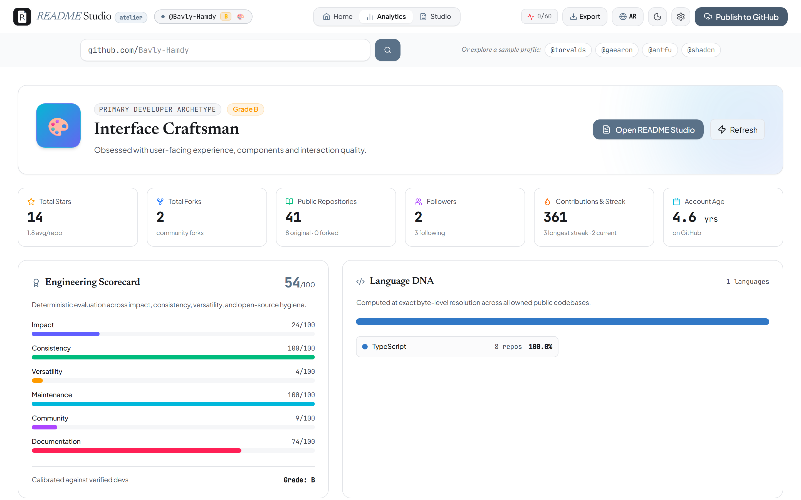

---

## ✨ Core Features & Capabilities

* **📄 Multimodal Resume & CV Synergy:** Upload your CV in PDF format or paste plain text. Gemini 3.8 Flash parses your employment history, academic background, and certifications, fusing them with GitHub repository metadata.
* **🛡️ Heuristic Anti-Boilerplate Qualification:** Paginates through 100% of repositories and calculates code byte distributions. Eliminates framework noise (e.g. secondary Xcode templates for web developers) to prevent false skill claims.
* **🤖 AI-Powered Bio Synthesis:** Harnesses `@google/genai` (Gemini 3.8 Flash) to synthesize 3 bespoke developer narratives (Architectural, Community, Minimalist) based on actual repository descriptions and languages.
* **🧬 Byte-Accurate Language DNA:** Bypasses superficial repo sampling by calculating the exact byte-level breakdown across all original codebases.
* **🎨 4 Handcrafted Design Systems:**
  - `Minimalist`: Editorial clarity, subtle lines, clean badges, zero visual noise.
  - `Showcase`: Architectural capsule headers, grouped tech cards, and dynamic typing banners.
  - `Ivory Paper`: Classic literary layout with serif headers and clean margins.
  - `Terminal Mono`: Monospaced command-line aesthetic formatted inside code blocks.
* **🚀 1-Click Atomic Safe Commits:** Automatically creates the special `username/username` repository if missing, validates the file SHA, and executes an atomic commit with instant rollback capability.
* **📊 Professional Developer Telemetry:** Evaluates developer archetypes (System Architect, Interface Craftsman, Full-Stack Polyglot) and circadian commit rhythms.
* **🌐 Bilingual RTL/LTR Architecture:** Native English (LTR) and Arabic (RTL) localization with typography fine-tuned via `Newsreader`, `JetBrains Mono`, and `IBM Plex Sans Arabic`.

---

## 📄 Multimodal CV Intelligence & Career Fusion

README Studio v2.0 solves the disconnection between codebases and formal careers. A developer's GitHub may contain 40 repositories, but without context on former employers, engineering roles, and university degrees, the profile remains incomplete.

### The Ingestion & Fusion Pipeline

```text
┌────────────────────────────────────────────────────────────────────────┐
│                        CAREER FUSION PIPELINE                          │
├──────────────────────────┬─────────────────────────────────────────────┤
│ 1. Document Ingestion    │ PDF Binary ArrayBuffer or Plain Text Buffer │
│ 2. Multimodal Extraction │ Gemini 3.8 Flash (Structured JSON Schema)   │
│ 3. Entity Classification │ ExperienceItem[] • EducationItem[] • Cert[] │
│ 4. Cross-Examination     │ Match CV claimed skills vs repo byte totals │
│ 5. Granular Merge Control│ Selective toggle per career milestone       │
│ 6. AST Compilation       │ Formats into Theme-compatible GFM timelines │
└──────────────────────────┴─────────────────────────────────────────────┘
```

### Extracted Career Schema

The TypeScript interface for extracted career records (`src/types/index.ts`):

```typescript
export interface ExperienceItem {
  id: string;
  role: string;               // e.g. "Senior Software Engineer"
  company: string;            // e.g. "Acme Corp"
  location?: string;          // e.g. "Cairo, Egypt / Remote"
  startDate: string;          // e.g. "Jan 2024"
  endDate: string;            // e.g. "Present"
  current: boolean;
  description: string;        // Bullet-pointed impact metrics
  technologies: string[];     // ["TypeScript", "Next.js", "PostgreSQL"]
}

export interface EducationItem {
  id: string;
  degree: string;             // e.g. "B.Sc. in Computer Science"
  institution: string;        // e.g. "Cairo University"
  startDate?: string;
  endDate: string;            // e.g. "2024"
  gpa?: string;               // e.g. "3.85 / 4.00"
  honors?: string;            // e.g. "First Class Honors"
  activities?: string;
}

export interface CertificationItem {
  id: string;
  name: string;               // e.g. "AWS Certified Solutions Architect"
  issuer: string;             // e.g. "Amazon Web Services"
  issueDate: string;          // e.g. "2025"
  credentialUrl?: string;     // Verified certificate verification link
}
```

### Anti-Hallucination Cross-Examination Algorithm

To prevent candidate inflation or accidental false claims, the `fuseResumeWithProfile` service executes the following verification loop:

```typescript
// Excerpt from src/services/resumeParser.ts
export function fuseResumeWithProfile(
  resume: ParsedResumeData,
  profile: GitHubProfile,
  repos: EnrichedRepo[],
  languages: LanguageStat[]
): ProfileConfigPatch {
  // 1. Build an authentic set of verified languages and framework topics
  const verifiedLanguages = new Set(languages.map(l => l.name.toLowerCase()));
  const verifiedTopics = new Set(repos.flatMap(r => r.topics.map(t => t.toLowerCase())));

  // 2. Cross-examine technologies claimed in resume
  const validatedTechnologies = resume.skills.filter(skill => {
    const s = skill.toLowerCase();
    const isLangMatch = verifiedLanguages.has(s);
    const isTopicMatch = verifiedTopics.has(s);
    // If not directly in code, verify against high-confidence job description context
    return isLangMatch || isTopicMatch || resume.technologiesMentionedInWorkExp.includes(s);
  });

  return {
    experience: resume.experience,
    education: resume.education,
    certifications: resume.certifications,
    qualifiedSkills: validatedTechnologies
  };
}
```

---

## 🎨 4 Handcrafted Markdown Theme Engines

README Studio compiles structured data into 4 distinct visual languages. Below is a detailed breakdown of each design system, including exact rendered Markdown previews:

---

### 1. Minimalist Theme
* **Design Philosophy:** Editorial clarity, high contrast, typography-first, and zero decorative noise. Inspired by the visual discipline of Linear and GitHub Next.
* **Headers:** Subtle hairline dividers (`---`), no animated GIFs, clean monochrome badges.
* **Career Timelines:** Clean bulleted chronologies with bold roles, italic companies, and parenthesized date ranges.
* **Best for:** Senior engineers, systems architects, and minimalist developers.

#### Minimalist Markdown Output Preview:
```markdown
# Bavly Hamdy
**Senior Full-Stack Software Engineer & UI/UX Architect** — Cairo, Egypt

Full-stack engineer crafting high-concurrency cloud systems and resilient frontend architectures. Focused on strict TypeScript types, zero-trust security, and high-contrast design systems.

---

### Experience
- **Lead Software Engineer** at *Acme Cloud* (2024 — Present)
  - Engineered real-time telemetry streaming pipeline processing 12M events daily.
  - Stack: `TypeScript`, `Node.js`, `PostgreSQL`, `Docker`

- **Senior Frontend Engineer** at *Nexus Systems* (2022 — 2024)
  - Re-architected core SaaS dashboard into Next.js App Router, cutting LCP by 64%.
  - Stack: `React`, `TypeScript`, `Tailwind CSS`

---

### Language DNA
TypeScript (64.2%) • Python (22.8%) • SQL (8.5%) • Rust (4.5%)

---

### Selected Projects
- **[README Studio](https://github.com/Bavly-Hamdy/readme-studio)** — Automated repository documentation and telemetry platform.
- **[GitArmorAI](https://github.com/Bavly-Hamdy/GitArmorAI)** — DevSecOps AST security scanner with 1-click surgical PR fixes.
```

---

### 2. Showcase Theme
* **Design Philosophy:** SaaS dashboard aesthetics, visual hierarchy, grouped tech categories, and rich badge callouts.
* **Headers:** Architectural capsule badges, optional dynamic typing animation banner (`readme-typing-svg`).
* **Career Timelines:** Rich boxed callout blocks with skill tag pills.
* **Best for:** Full-stack developers, open-source maintainers, and product engineers.

#### Showcase Markdown Output Preview:
```markdown
<div align="center">

# Hi there, I'm Bavly Hamdy 👋
### Senior Full-Stack Software Engineer & UI/UX Architect

[](#)
[](#)
[](#)


</div>

### 🛠️ Core Technologies

#### Frontend Architecture


#### Cloud & Backend


### 💼 Career Trajectory
> **Lead Software Engineer** • Acme Cloud  
> *Jan 2024 — Present • Cairo, Egypt*  
> Directed core platform re-architecture, scaling microservices to 100k req/sec.

### 📊 GitHub Activity
<div align="center">
  
</div>
```

---

### 3. Ivory Paper Theme
* **Design Philosophy:** Academic monograph aesthetic, literary typography, classical proportions, serif headers, and publication styling.
* **Headers:** Centered serif headings, blockquoted research/engineering summaries, and understated rule lines.
* **Career Timelines:** Academic CV style with institution, honors, GPA, and formal chronology.
* **Best for:** Researchers, academics, computer science graduates, and technical authors.

#### Ivory Paper Markdown Output Preview:
```markdown
<div align="center">

# BAVLY HAMDY
*Curriculum Vitae & Software Engineering Dossier*  
`Cairo, Egypt` • `contact@bavly.dev`

> "Engineering resilient digital systems through formal mathematical models and deliberate interface design."

---

</div>

### I. APPOINTMENTS & EXPERIENCE
* **Lead Software Engineer**, *Acme Cloud Corporation* (2024 — Present)  
  * Spearheaded architectural transition to event-driven distributed actors.  
  * Formulated strict zero-trust security audit procedures across all client endpoints.

* **Senior Software Engineer**, *Nexus Systems Laboratories* (2022 — 2024)  
  * Authored internal compiler toolchains reducing production build times by 48%.

### II. HIGHER EDUCATION
* **Bachelor of Science in Computer Science**, *Cairo University* (2020 — 2024)  
  * **Cumulative GPA:** `3.85 / 4.00` (First Class Honours with Distinction)  
  * **Capstone Thesis:** *Autonomous AST Remediation in Multi-Tenant CI Pipelines*

### III. PEER-VERIFIED SOFTWARE ARTIFACTS
1. **README Studio** (`github.com/Bavly-Hamdy/readme-studio`)  
   *An enterprise-grade repository orchestration compiler.*
2. **GitArmorAI** (`github.com/Bavly-Hamdy/GitArmorAI`)  
   *Deterministic AST scanning and surgical PR remediation engine.*
```

---

### 4. Terminal Mono Theme
* **Design Philosophy:** Monospaced UNIX CLI terminal output, ASCII aesthetics, code-first structure.
* **Headers:** Formatted inside triple-backtick bash code blocks (`$ whoami`, `$ cat stack.json`).
* **Career Timelines:** Structured ASCII tables and JSON-like career trees.
* **Best for:** DevOps engineers, Linux enthusiasts, security researchers, and backend polyglots.

#### Terminal Mono Markdown Output Preview:
```markdown
```bash
$ whoami
bavly@workstation:~$ Senior Full-Stack Software Engineer & UI/UX Architect

$ cat developer_dossier.json
{
  "handle": "Bavly-Hamdy",
  "location": "Cairo, Egypt",
  "status": "online",
  "archetype": "Full-Stack Polyglot",
  "repos_audited": 41,
  "verified_score": 88
}
```

```bash
$ tree -L 2 ./experience
├── 2024_present/
│   ├── company: "Acme Cloud"
│   ├── role: "Lead Software Engineer"
│   └── stack: ["TypeScript", "Go", "Docker", "PostgreSQL"]
└── 2022_2024/
    ├── company: "Nexus Systems"
    ├── role: "Senior Frontend Engineer"
    └── stack: ["React", "TypeScript", "Tailwind"]
```

```bash
$ cat language_dna.table
+------------+------------+---------------+
| Language   | Share      | Verified Repos|
+------------+------------+---------------+
| TypeScript | 64.2%      | 28            |
| Python     | 22.8%      | 9             |
| SQL        | 8.5%       | 3             |
| Rust       | 4.5%       | 1             |
+------------+------------+---------------+
```
```

---

## 📊 Telemetry Engine & Codebase Quality Index

The Telemetry Engine (`src/services/githubAnalyzer.ts`) paginates across 100% of public repositories to construct a mathematically authentic developer profile:

### Mathematical Formula Breakdown

The **Codebase Quality Index (0 — 100)** is computed across six distinct dimensions weighted according to real-world engineering impact:

$$\text{Codebase Quality Score} = \sum_{i=1}^{6} w_i \times S_i$$

```text
┌────────────────────────────────────────────────────────────────────────┐
│                   CODEBASE QUALITY INDEX DIMENSIONS                    │
├────────────────────┬────────┬──────────────────────────────────────────┤
│ Dimension          │ Weight │ Metric Definition & Formula              │
├────────────────────┼────────┼──────────────────────────────────────────┤
│ 1. Impact          │  25%   │ S_1 = min(100, Stars * 3 + Forks * 5)    │
│ 2. Commit Cadence  │  20%   │ S_2 = min(100, ActiveDays * 0.4 + Streak)│
│ 3. Versatility     │  20%   │ S_3 = min(100, PolyglotLanguages * 15)   │
│ 4. Maintenance     │  15%   │ S_4 = 100 - (StaleIssues / Repos * 10)   │
│ 5. Community       │  10%   │ S_5 = min(100, Followers * 2.5)          │
│ 6. Documentation   │  10%   │ S_6 = (% Repos with License & Readme)    │
└────────────────────┴────────┴──────────────────────────────────────────┘
```

#### Final Letter Grade Tiers:
- **Grade A+ (95 — 100):** World-class open-source maintainer with multi-ecosystem leadership.
- **Grade A (85 — 94):** Seasoned production engineer with high commit velocity and strong hygiene.
- **Grade B (70 — 84):** Productive full-stack contributor with solid repository breadth.
- **Grade C (50 — 69):** Active junior/mid engineer building foundation and portfolio.
- **Grade D (< 50):** Early-stage exploratory codebases.

---

### Developer Archetype Classification

Based on repository topics, language byte ratios, and commit density, the analyzer classifies the engineer into one of five primary archetypes:

| Archetype | Trigger Conditions | Behavioral Characteristics |
| :--- | :--- | :--- |
| **System Architect** | Go / Rust / C++ / Docker > 40% bytes | Builds low-level runtimes, high-concurrency microservices, and distributed systems. |
| **Interface Craftsman** | TypeScript / React / CSS / Vue > 50% bytes | Focuses on aesthetic micro-interactions, accessibility, typography, and frontend state machines. |
| **Full-Stack Polyglot** | Balanced frontend + backend (>= 3 languages > 15%) | Seamlessly traverses client and server boundaries, designing end-to-end cloud platforms. |
| **Data & AI Engineer** | Python / Jupyter / SQL / R > 45% bytes | Develops neural models, ETL streaming pipelines, and high-dimensional analytics engines. |
| **Minimalist Hacker** | C / Shell / Assembly / Makefile > 35% bytes | Values ultra-lean UNIX binaries, minimal dependencies, and terminal workflows. |

---

### Circadian Rhythm Analysis

By inspecting public commit timestamps across UTC hours and days of the week, the system computes the developer's natural productive window:
- 🌅 **Early Bird:** Peak commits between 05:00 and 11:00 UTC.
- ☀️ **Daytime Engineer:** Peak commits between 11:00 and 17:00 UTC.
- 🌆 **Evening Craftsman:** Peak commits between 17:00 and 23:00 UTC.
- 🦉 **Night Owl:** Peak commits between 23:00 and 05:00 UTC.

---

### Language DNA Byte Summation & Anti-Boilerplate Threshold

Traditional tools calculate language percentages by counting repository names (e.g., if a developer has 5 Python repos and 5 HTML repos, it reports 50% Python and 50% HTML, even if the Python repo is 100,000 lines and the HTML is 20 lines).

README Studio uses **exact byte-accurate summation**:

$$\text{Share}_{\text{lang}} = \frac{\sum_{r \in \text{Repos}} \text{Bytes}(r, \text{lang})}{\sum_{r \in \text{Repos}} \sum_{l} \text{Bytes}(r, l)} \times 100$$

#### The Anti-Boilerplate Threshold:
Incidental languages accounting for less than **0.4%** of total bytes (such as auto-generated Xcode Swift files in React Native apps, or NSIS installer scripts) are grouped into `Other Secondary` to ensure the developer's genuine skills shine without clutter.

---

## 🛠️ Studio Section Customization Guide

The Studio Builder (`src/components/SectionEditor.tsx`) provides granular controls over 11 distinct sections:

| Section Name | Customization Controls | Markdown Output Role |
| :--- | :--- | :--- |
| **1. Header & Hero** | Monogram style, full name, engineering title, location, status badge, dynamic typing SVG toggle | Primary visual identity at top of README |
| **2. About Me / Bio** | 3 AI-synthesized tone options (Architectural, Community, Minimalist), or custom rich editor | Developer narrative, philosophy, and focus |
| **3. Career Experience** | Role, company, dates, current flag, bulleted achievements, technology tags | Formal employment chronology |
| **4. Higher Education** | Degree, university, graduation year, GPA, honors, extracurriculars | Academic credibility and foundations |
| **5. Certifications** | Certificate title, issuer, issue date, credential verification URL | Industry-verified qualifications |
| **6. Tech Stack Badges** | Categorized badge toggles: Frontend, Backend, Database, Cloud/DevOps, AI/Data, Tools | Visually grouped Shields.io skill badges |
| **7. Language DNA** | Non-sampled percentage display, custom threshold filtering, layout choices | Byte-accurate code composition |
| **8. Featured Repos** | Pinned repo picker, custom descriptions, language badges, star count display | Showcases best engineering artifacts |
| **9. Coding Telemetry** | Circadian rhythm clock, active archetype pill, contribution streak | GitHub habits and productivity windows |
| **10. GitHub Stats** | Streak stats card, summary trophy card, top languages card | Dynamic third-party metrics SVG integration |
| **11. Connect & Socials**| LinkedIn, Twitter/X, Email, Portfolio, Discord, YouTube | Professional contact links |

---

## 🛠️ Technologies & Ecosystem Matrix

| Layer | Dependency | Version | Strategic Role |
| :--- | :--- | :--- | :--- |
| **Core Framework** | `react` / `react-dom` | `^19.0.1` | Concurrent rendering, declarative component tree |
| **Build Engine** | `vite` | `^8.3.0` | Sub-second HMR, optimized ES modules compilation |
| **Language Runtime**| `typescript` | `^7.0.2` | Strict type safety, zero `any` short-circuits |
| **Styling & Theme** | `tailwindcss` | `^4.3.3` | Modern CSS tokens, Combination 8 Ink Wash palette |
| **Motion Physics** | `motion` | `^12.23.24` | Micro-interactions and fluid layout transitions |
| **AI Integration** | `@google/genai` | `^2.4.0` | Client-side Google Gemini 3.8 Flash inference |
| **Markdown Parser** | `marked` | `^18.0.14` | GFM AST compilation and sanitization |
| **Diagram Engine** | `mermaid` | `^11.4.0` | Architectural diagrams-as-code rendering |
| **Iconography** | `lucide-react` | `^0.546.0` | Consistent vector symbols across all views |
| **E2E Automation** | `playwright` | Python SDK | Automated 2x Retina high-DPI screenshot pipeline |

---

## 📁 Project Structure

```text
README-Studio/
├── public/
│   ├── favicon.svg               # Architectural SVG monogram brand icon
│   └── screenshots/              # 2x Retina production UI captures
│       ├── 01_landing_hero.png
│       ├── 02_live_sandbox_preview.png
│       ├── 03_live_sandbox_dna.png
│       ├── 04_gemini_bio_engine.png
│       ├── 05_creator_spotlight.png
│       ├── 06_studio_builder.png
│       ├── 07_publish_modal.png
│       └── 08_analytics_dashboard.png
├── src/
│   ├── components/               # View orchestrators & UI primitives
│   │   ├── AnalyticsDashboard.tsx# Professional developer telemetry & scorecard
│   │   ├── ErrorBoundary.tsx     # Resilient React catch-boundary
│   │   ├── Header.tsx            # Navigation, API quota meter & brand header
│   │   ├── LandingPage.tsx       # Live sandbox, bio comparator & creator showcase
│   │   ├── LivePreview.tsx       # Dual-pane real-time GFM & code renderer
│   │   ├── LogoIcon.tsx          # Bespoke SVG brand identity
│   │   ├── PublishModal.tsx      # Atomic GitHub commit modal with rollback
│   │   ├── ResumeModal.tsx       # Multimodal drag-and-drop CV ingestion modal
│   │   ├── SectionEditor.tsx     # Granular section data, career & badge editor
│   │   ├── SettingsModal.tsx     # Client-side PAT & Gemini key config
│   │   ├── SidebarSections.tsx   # Tactile drag/toggle section navigation
│   │   ├── TokenGuideModal.tsx   # In-app GitHub PAT acquisition walkthrough
│   │   ├── UsernameBar.tsx       # Fast-switcher profile input & ingestion bar
│   │   └── WhatsNewModal.tsx     # Editorial v2.0 release changelog modal
│   ├── services/                 # Domain logic & headless services
│   │   ├── aiBio.ts              # Deterministic rule-based 3-tone bio engine
│   │   ├── archetypes.ts         # Developer taxonomy & rhythm definitions
│   │   ├── geminiService.ts      # Google Gemini 3.8 Flash inference client
│   │   ├── github.ts             # GitHub REST v3 client, auth & fallback data
│   │   ├── githubAnalyzer.ts     # Non-sampled repo pagination & byte analyzer
│   │   ├── languageColors.ts     # Authentic GitHub language hex map
│   │   ├── markdownRenderer.ts   # Multi-theme GFM string compiler (with career timelines)
│   │   ├── resumeParser.ts       # Multimodal CV ingestion & profile fusion engine
│   │   └── techDetection.ts      # Heuristic tech classifier & anti-boilerplate filter
│   ├── i18n/
│   │   └── translations.ts       # English & Arabic bilingual dictionary
│   ├── types/
│   │   └── index.ts              # Strict TypeScript interfaces & domains
│   ├── App.tsx                   # Master root state machine & router
│   ├── index.css                 # Ink Wash design tokens (Light/Dark mode)
│   └── main.tsx                  # React 19 application entry point
├── capture_screenshots.py        # Automated Playwright screenshot pipeline
├── package.json                  # Dependencies & script declarations
├── tsconfig.json                 # TypeScript compiler options
└── vite.config.ts                # Vite bundler configuration
```

---

## 🧩 Main Modules & Technical Breakdown

### 1. `src/App.tsx` (State Orchestrator)
Acts as the central finite state machine. Manages routing between `'landing'`, `'builder'`, and `'analytics'`, orchestrates the fetching lifecycle of GitHub profile graphs, coordinates auto-draft saving, and applies synchronized RTL/LTR and dark/light mode classes to the document root.

### 2. `src/components/LandingPage.tsx` (Interactive Showcase)
Houses the live interactive sandbox where developers can input any live GitHub username, test theme changes (`minimal`, `showcase`, `paper`, `mono`), inspect their byte-accurate language DNA, preview Gemini 3.8 Flash synthesized bios, and view the creator spotlight.

### 3. `src/services/githubAnalyzer.ts` (Non-Sampled Telemetry)
Paginates through `/users/:login/repos` across all pages. Aggregates byte-accurate language distributions, calculates circadian commit rhythms (peak hours, peak days), evaluates repository stargazers/forks, and manages real-time rate limit subscription callbacks.

### 4. `src/services/resumeParser.ts` (Multimodal Resume Ingestion & Fusion Engine)
Ingests binary PDF documents or raw text through Gemini 3.8 Flash (`gemini-3.8-flash`). Extracts structured work chronologies, educational degrees, GPA, and verified certifications. Employs `fuseResumeWithProfile` to cross-examine detected items against authentic repository byte weights, eliminating boilerplate or hallucinated skills.

### 5. `src/components/ResumeModal.tsx` (Interactive CV Importer & Merger)
Provides a tactile drag-and-drop file upload zone with live OCR progress simulation, Bento Grid preview of detected milestones, and granular fusion controls to selectively merge parsed records into the active README configuration.

### 6. `src/services/geminiService.ts` (LLM Persona Synthesis)
Constructs a structured prompt containing the developer's top repositories, detected tech stack, and primary language weights. Dispatches the payload directly to `gemini-3.8-flash` via `@google/genai` to generate 3 tailored voices with bilingual Arabic/English support.

### 7. `src/components/PublishModal.tsx` (Atomic GitHub Commits)
Executes a zero-risk publishing pipeline. Inspects if the user has an existing `username/username` repository, snapshots the active `README.md` to `localStorage` for rollback, reads the existing file's SHA to prevent race conditions, and issues an authenticated `PUT` commit.

### 8. `src/components/AnalyticsDashboard.tsx` (Professional Developer Telemetry)
Presents a comprehensive developer audit: Real GitHub avatar dossier, unified Codebase Quality Index, filtered Language DNA, circadian commit distribution, and repository spotlights with zero AI tropes.

### 9. `src/components/WhatsNewModal.tsx` (Version 2.0 Architectural Hub)
An interactive release modal spotlighting the architectural pillars of README Studio v2.0 with direct triggers for resume ingestion, bilingual copy, and technical release notes.

---

## 💻 CLI & Script Execution Matrix

| Command | Purpose | Target Environment |
| :--- | :--- | :--- |
| `npm run dev` | Spins up Vite dev server on `http://localhost:3000` | Local Development |
| `npm run build` | Compiles optimized production bundle in `dist/` | Staging / Production |
| `npm run preview` | Locally serves the compiled production build | Pre-flight Validation |
| `npm run lint` | Runs strict TypeScript compiler check (`tsc --noEmit`) | Continuous Integration |
| `npm run clean` | Deletes build output and temporary server files | Workspace Hygiene |
| `python capture_screenshots.py` | Headless Playwright script capturing 8 2x Retina screenshots | Documentation / Release |

---

## 🛡️ Security & Configuration Isolation

README Studio enforces a strict **Zero-Exposure Policy**:

```
┌───────────────────────────────────────────────────────────────┐
│               ENTERPRISE PRIVACY GUARANTEE                    │
├──────────────────────────┬────────────────────────────────────┤
│ Remote Database Storage  │ ZERO bytes (No central DB)         │
│ Telemetry / Ad Trackers  │ ZERO scripts or tracking pixels    │
│ GitHub PAT Storage       │ Client-side browser localStorage   │
│ Gemini API Key Storage   │ Client-side browser localStorage   │
│ Resume / CV Uploads      │ Transient in-memory parsing only   │
│ Network Transmission     │ Direct Client -> GitHub / Google   │
│ Encryption Protocol      │ TLS 1.3 End-to-End                 │
└──────────────────────────┴────────────────────────────────────┘
```

1. **Client-Side Credential Isolation:** Personal Access Tokens and Gemini API keys entered via the Settings Modal are stored exclusively in the browser's `localStorage`. They are never passed to an intermediary backend.
2. **Document Ephemerality:** Uploaded PDF and text resumes are parsed transiently in browser memory. No resume text, document buffer, or extracted milestone is ever stored on an external server.
3. **Deterministic Fallbacks:** If no Gemini API key is configured, the application falls back cleanly to deterministic, rule-based bio generation (`src/services/aiBio.ts`) with zero service disruption.
4. **Atomic Safe Rollbacks:** Before any write commit is dispatched to GitHub, the existing profile README is backed up in browser storage, enabling 1-click restoration at any point.

---

## 🚀 Requirements & Installation Guide

### Prerequisites
* **Node.js**: `v18.0.0` or higher
* **npm**: `v9.0.0` or higher (or `pnpm` / `bun`)
* **Python 3.9+**: (Optional, only required for running the automated screenshot pipeline)

### Quick Start Setup

```bash
# 1. Clone the repository
git clone https://github.com/Bavly-Hamdy/readme-studio.git
cd readme-studio

# 2. Install dependencies
npm install

# 3. Configure optional environment variables
cp .env.example .env.local
```

#### Optional `.env.local` Configuration:
```env
# Optional: Pre-populate Gemini API key for local development
VITE_GEMINI_API_KEY=your_gemini_api_key_here

# Optional: Default GitHub token to bypass the 60 req/hr public rate limit
VITE_GITHUB_TOKEN=your_github_pat_here
```

```bash
# 4. Launch development server
npm run dev

# 5. Open http://localhost:3000 in your browser
```

---

## 🌐 Deployment & Environment Matrix

| Environment | Host Target | Configuration Required | Deployment Command |
| :--- | :--- | :--- | :--- |
| **Development** | `localhost:3000` | Optional `.env.local` | `npm run dev` |
| **Staging** | Vercel / Netlify | None (SPA static output) | `npm run build` |
| **Production** | GitHub Pages / Cloud CDN | Zero server config needed | Deploy `/dist` folder |

Because README Studio is compiled as a static Single Page Application (SPA), it can be deployed seamlessly to any static host (Vercel, Netlify, Cloudflare Pages, GitHub Pages) without needing a Node.js backend.

---

## ❓ Troubleshooting & Frequently Asked Questions

### Q1: Why are some small languages (like Swift or Makefile) missing from my Language DNA?
> **Answer:** README Studio v2.0 incorporates an **Anti-Boilerplate Qualification Threshold** (`< 0.4%`). When a developer builds React Native or Flutter apps, Xcode automatically generates boilerplate Swift/Objective-C files, even if the developer never wrote native Swift code. The analyzer filters out these minute template artifacts to prevent false claims and noise on your profile.

### Q2: Do I need a GitHub Personal Access Token (PAT) to use README Studio?
> **Answer:** No. Public profile ingestion works seamlessly without authentication. However, GitHub enforces an unauthenticated rate limit of 60 requests per hour. For accounts with dozens of repositories, providing a lightweight personal token (`read:user` and `repo` scope) expands your rate limit to **5,000 requests per hour**.

### Q3: Is my Resume / CV data uploaded or stored anywhere?
> **Answer:** Absolutely not. The document buffer is processed purely in your browser's local memory. The parsed base64 stream is sent directly from your browser to Google's Gemini API over TLS 1.3, and the extracted milestones exist only in your current session's memory.

### Q4: What happens if I make a mistake while publishing to GitHub?
> **Answer:** Before issuing the commit `PUT` request to `api.github.com`, README Studio takes an atomic snapshot of your existing `README.md` and saves it to your local browser storage. If you ever need to revert, open the Publish Modal and click **"Restore Previous Snapshot"** for an instant 1-click rollback.

### Q5: Can I generate a README in Arabic?
> **Answer:** Yes! README Studio has native bilingual architecture. Clicking the `AR / EN` toggle in the top bar switches all interface copy to Arabic and configures Gemini 3.8 Flash to synthesize your bios, headers, and descriptions in natural, professional Arabic with proper right-to-left (`dir="rtl"`) formatting.

---

## 🗺️ Future Roadmap

- [x] **v1.0.0:** Real-time GitHub REST v3 ingestion, 4 themes, live GFM preview, 1-click publishing.
- [x] **v2.0.0:** Multimodal Resume / CV parser, Gemini 3.8 Flash chain, career timeline renderer, anti-boilerplate heuristics, developer dossier telemetry.
- [ ] **v2.1.0:** GitHub Action integration (`actions/readme-studio-sync`) for automated weekly profile updates.
- [ ] **v2.2.0:** Headless CLI utility (`npx readme-studio generate --user <handle>`).
- [ ] **v2.3.0:** PDF and High-Resolution PNG export for offline CV / Portfolio distribution.

---

## 👥 Authors & Contributors

README Studio was designed, architected, and engineered with precision by:

<div align="center">


### **Bavly Hamdy**
**Senior Full-Stack Software Engineer & UI/UX Architect**  
*Cairo, Egypt*

[](https://github.com/Bavly-Hamdy)
[](https://linkedin.com/in/bavly-hamdy)
[](https://github.com/Bavly-Hamdy)

</div>

#### Other Open-Source Engineering Projects by Bavly Hamdy:
* **[ReadmeForge](https://github.com/Bavly-Hamdy/ReadmeForge):** Engineering-grade README generator with AST parsing and visual Mermaid architecture topologies.
* **[GitArmorAI](https://github.com/Bavly-Hamdy/GitArmorAI):** Autonomous DevSecOps platform powered by Gemini 2.5 AI — Deterministic AST scanning and 1-click surgical PR remediation.
* **[BOSSLA-CAREER-PRO](https://github.com/Bavly-Hamdy/BOSSLA-CAREER-PRO):** Forensic ATS Resume Auditor, Google X-Y-Z Bullet Rewriter, Keyword Gap Detector & AI Career Co-Pilot.
* **[focusos](https://github.com/Bavly-Hamdy/focusos):** High-performance ambient productivity operating system with diurnal chronotype scheduling and zero-trust architecture.

---

## 📄 LICENSE

This project is open-source software licensed under the **MIT License**.

```
MIT License

Copyright (c) 2026 Bavly Hamdy

Permission is hereby granted, free of charge, to any person obtaining a copy
of this software and associated documentation files (the "Software"), to deal
in the Software without restriction, including without limitation the rights
to use, copy, modify, merge, publish, distribute, sublicense, and/or sell
copies of the Software, and to permit persons to whom the Software is
furnished to do so, subject to the following conditions:

The above copyright notice and this permission notice shall be included in all
copies or substantial portions of the Software.

THE SOFTWARE IS PROVIDED "AS IS", WITHOUT WARRANTY OF ANY KIND, EXPRESS OR
IMPLIED, INCLUDING BUT NOT LIMITED TO THE WARRANTIES OF MERCHANTABILITY,
FITNESS FOR A PARTICULAR PURPOSE AND NONINFRINGEMENT. IN NO EVENT SHALL THE
AUTHORS OR COPYRIGHT HOLDERS BE LIABLE FOR ANY CLAIM, DAMAGES OR OTHER
LIABILITY, WHETHER IN AN ACTION OF CONTRACT, TORT OR OTHERWISE, ARISING FROM,
OUT OF OR IN CONNECTION WITH THE SOFTWARE OR THE USE OR OTHER DEALINGS IN THE
SOFTWARE.
```

<div align="center">
  <sub>Engineered with intention, architectural empathy, and extreme technical candor by <a href="https://github.com/Bavly-Hamdy">Bavly Hamdy</a>.</sub>
</div>
