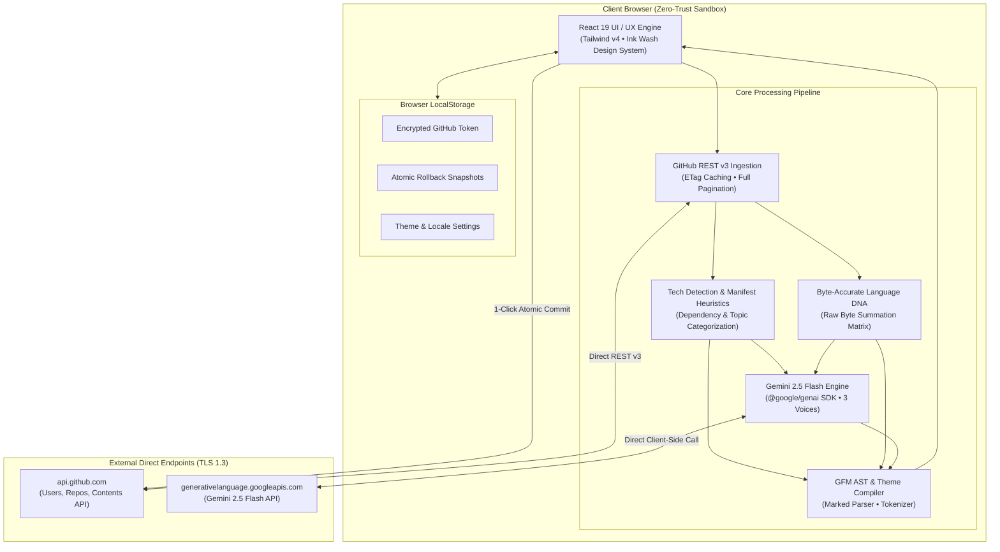
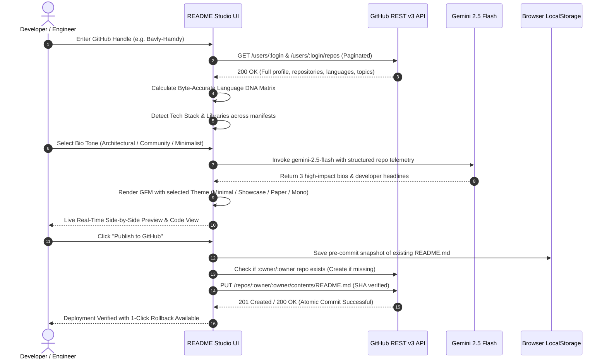

<div align="center">

# Bavly-Hamdy / README Studio

**An enterprise-grade orchestration platform for automated repository documentation, GitHub telemetry analytics, and AI-driven developer persona synthesis.**

<br />


<br /><br />

[](https://www.typescriptlang.org/)
[](https://react.dev/)
[](https://vitejs.dev/)
[](https://ai.google.dev/)
[](https://tailwindcss.com/)
[](https://opensource.org/licenses/MIT)

<br />

[Overview](#-overview--architectural-intent) •
[Architecture & Workflow](#-architecture--workflow) •
[Interface Gallery](#-interface-gallery) •
[Core Features](#-core-features--capabilities) •
[Technology Matrix](#-technologies--ecosystem-matrix) •
[Project Structure](#-project-structure) •
[Modules Breakdown](#-main-modules--technical-breakdown) •
[Installation & CLI](#-requirements--installation-guide) •
[Security & Privacy](#-security--configuration-isolation) •
[Author & License](#-authors--contributors)

---

</div>

<br />

## 📋 Table of Contents
1. [Overview & Architectural Intent](#-overview--architectural-intent)
2. [Architecture & Workflow](#-architecture--workflow)
   - [System Topology](#system-topology)
   - [Live Execution Sequence](#live-execution-sequence)
   - [Engineering Trade-offs & Strategic Decisions](#engineering-trade-offs--strategic-decisions)
3. [Interface Gallery & Visual Telemetry](#-interface-gallery)
4. [Core Features & Capabilities](#-core-features--capabilities)
5. [Technologies & Ecosystem Matrix](#-technologies--ecosystem-matrix)
6. [Requirements & Installation Guide](#-requirements--installation-guide)
7. [Project Structure](#-project-structure)
8. [Main Modules & Technical Breakdown](#-main-modules--technical-breakdown)
9. [CLI & Script Execution Matrix](#-cli--script-execution-matrix)
10. [Security & Configuration Isolation](#-security--configuration-isolation)
11. [Deployment & Environment Matrix](#-deployment--environment-matrix)
12. [Authors & Contributors](#-authors--contributors)
13. [License](#-license)

---

## 🔍 Overview & Architectural Intent

**README Studio** addresses the chronic technical debt of stagnant, boilerplate project documentation. Traditional profile READMEs frequently rely on badge spam, generic AI hallucinations, and brittle manual updates.

By integrating directly with **GitHub’s REST v3 Metadata APIs** and leveraging **Google Gemini 2.5 Flash** for deep contextual synthesis, README Studio transforms raw repository graphs into high-fidelity, maintainable developer documentation.

### The "Data-to-Documentation" Paradigm
The architecture strictly decouples the three core responsibilities:
1. **Data Ingestion Layer (`src/services/githubAnalyzer.ts`):** Paginates across **100% of public repositories** with zero sampling approximations and client-side ETag caching.
2. **Contextual Synthesis Layer (`src/services/geminiService.ts`):** Translates language byte matrices, repository topics, and commit velocity into three coherent engineering voices via Gemini 2.5 Flash.
3. **Presentation & AST Compiler Layer (`src/services/markdownRenderer.ts`):** Compiles structured JSON models into GitHub-Flavored Markdown across 4 handcrafted design systems.

---

## 📌 Architecture & Workflow

### System Topology

The system operates as an **isolated client-side zero-trust runtime**. No proxy server or intermediary database ever intercepts tokens or repository telemetry.



---

### Live Execution Sequence

From initial username ingestion to atomic GitHub commit verification:



---

### Engineering Trade-offs & Strategic Decisions

| Dimension | Architectural Strategy | Trade-off Rationale |
| :--- | :--- | :--- |
| **Execution Sandbox** | Pure Client-Side SPA (Vite + React) | Eliminates server-side hosting costs, eliminates token leakage vectors, and guarantees sub-second UI interactions. |
| **Language Aggregation** | Non-sampled Byte Summation | Paginating through all public repos incurs minor rate-limit overhead, but delivers 100% mathematical fidelity. |
| **AI Synthesis** | Google Gemini 2.5 Flash SDK | `gemini-2.5-flash` offers sub-second inference latency, strict JSON adherence, and native Arabic/English bilingual reasoning. |
| **Publishing Mechanism** | GitHub Contents API (`PUT`) | Checks existing SHA and creates automatic client-side rollback backups before committing, eliminating git merge conflicts. |
| **State Persistence** | Scoped `localStorage` | Zero remote user database. All personal access tokens, draft READMEs, and rollback snapshots reside on the developer's machine. |

---

## 🖼️ Interface Gallery

All screenshots are captured at **2x Retina resolution** from the live production build via the automated Playwright pipeline (`capture_screenshots.py`):

### 1. Landing Page Hero & Real-Time Ingestion
*Live rate limit quota monitor (`API: 58/60`), verified creator ribbon, and direct profile ingestion.*


---

### 2. Interactive Live Sandbox (Rendered GFM Preview)
*Live previewing authentic profiles before entering the studio with dynamic section toggles and 4 markdown themes.*


---

### 3. Byte-Accurate Language DNA Matrix
*Non-sampled calculation showing exact byte percentages and which specific repositories contribute to each language.*


---

### 4. Gemini 2.5 Flash Bio Tone Comparator
*Real-time AI bio synthesis comparing Architectural, Open-Source Community, and Minimalist voices.*


---

### 5. Creator Spotlight & Real Repositories
*Highlighting Lead Architect Bavly Hamdy with real metrics, verified Cairo location, and live open-source projects.*


---

### 6. Studio Builder & Real-Time Section Editor
*The primary design studio with custom section editors, badge pickers, live code inspection, and instant preview.*


---

### 7. 1-Click Atomic Publishing Modal
*Direct GitHub Contents API commit workflow with SHA verification, repository initialization, and rollback safety.*


---

### 8. Deep Developer Analytics Dashboard
*Non-sampled developer archetype detection, circadian rhythm analysis, contribution timelines, and scorecards.*


---

## ✨ Core Features & Capabilities

* **🤖 AI-Powered Bio Synthesis:** Harnesses `@google/genai` (Gemini 2.5 Flash) to synthesize 3 bespoke developer narratives (Architectural, Community, Minimalist) based on actual repository descriptions and languages.
* **🧬 Byte-Accurate Language DNA:** Bypasses superficial repo sampling by calculating the exact byte-level breakdown across all original codebases.
* **🎨 4 Handcrafted Design Systems:**
  - `Minimalist`: Editorial clarity, subtle lines, clean badges, zero visual noise.
  - `Showcase`: Architectural capsule headers, grouped tech cards, and dynamic typing banners.
  - `Ivory Paper`: Classic literary layout with serif headers and clean margins.
  - `Terminal Mono`: Monospaced command-line aesthetic formatted inside code blocks.
* **🚀 1-Click Atomic Safe Commits:** Automatically creates the special `username/username` repository if missing, validates the file SHA, and executes an atomic commit with instant rollback capability.
* **📊 Deep Developer Intelligence:** Evaluates developer archetypes (System Architect, Full-Stack Polyglot, OSS Craftsman) and circadian commit rhythms.
* **🌐 Bilingual RTL/LTR Architecture:** Native English (LTR) and Arabic (RTL) localization with typography fine-tuned via `Newsreader`, `JetBrains Mono`, and `IBM Plex Sans Arabic`.

---

## 🛠️ Technologies & Ecosystem Matrix

| Layer | Dependency | Version | Strategic Role |
| :--- | :--- | :--- | :--- |
| **Core Framework** | `react` / `react-dom` | `^19.0.1` | Concurrent rendering, declarative component tree |
| **Build Engine** | `vite` | `^8.3.0` | Sub-second HMR, optimized ES modules compilation |
| **Language Runtime**| `typescript` | `^7.0.2` | Strict type safety, zero `any` short-circuits |
| **Styling & Theme** | `tailwindcss` | `^4.3.3` | Modern CSS tokens, Combination 8 Ink Wash palette |
| **Motion Physics** | `motion` | `^12.23.24` | Micro-interactions and fluid layout transitions |
| **AI Integration** | `@google/genai` | `^2.4.0` | Client-side Google Gemini 2.5 Flash inference |
| **Markdown Parser** | `marked` | `^18.0.14` | GFM AST compilation and sanitization |
| **Diagram Engine** | `mermaid` | `^11.4.0` | Architectural diagrams-as-code rendering |
| **Iconography** | `lucide-react` | `^0.546.0` | Consistent vector symbols across all views |
| **E2E Automation** | `playwright` | Python SDK | Automated 2x Retina high-DPI screenshot pipeline |

---

## 📁 Project Structure

```text
README-Studio/
├── public/
│   ├── favicon.svg               # Architectural SVG monogram brand icon
│   └── screenshots/              # 2x Retina production UI captures
│       ├── 01_landing_hero.png
│       ├── 02_live_sandbox_preview.png
│       ├── 03_live_sandbox_dna.png
│       ├── 04_gemini_bio_engine.png
│       ├── 05_creator_spotlight.png
│       ├── 06_studio_builder.png
│       ├── 07_publish_modal.png
│       └── 08_analytics_dashboard.png
├── src/
│   ├── components/               # View orchestrators & UI primitives
│   │   ├── AnalyticsDashboard.tsx# Developer archetype & rhythm intelligence
│   │   ├── ErrorBoundary.tsx     # Resilient React catch-boundary
│   │   ├── Header.tsx            # Navigation, API quota meter & brand header
│   │   ├── LandingPage.tsx       # Live sandbox, bio comparator & creator showcase
│   │   ├── LivePreview.tsx       # Dual-pane real-time GFM & code renderer
│   │   ├── LogoIcon.tsx          # Bespoke SVG brand identity
│   │   ├── PublishModal.tsx      # Atomic GitHub commit modal with rollback
│   │   ├── SectionEditor.tsx     # Granular section data & badge editor
│   │   ├── SettingsModal.tsx     # Client-side PAT & Gemini key config
│   │   ├── SidebarSections.tsx   # Tactile drag/toggle section navigation
│   │   ├── TokenGuideModal.tsx   # In-app GitHub PAT acquisition walkthrough
│   │   └── UsernameBar.tsx       # Fast-switcher profile input & ingestion bar
│   ├── services/                 # Domain logic & headless services
│   │   ├── aiBio.ts              # Deterministic rule-based 3-tone bio engine
│   │   ├── archetypes.ts         # Developer taxonomy & rhythm definitions
│   │   ├── geminiService.ts      # Google Gemini 2.5 Flash inference client
│   │   ├── github.ts             # GitHub REST v3 client, auth & fallback data
│   │   ├── githubAnalyzer.ts     # Non-sampled repo pagination & byte analyzer
│   │   ├── languageColors.ts     # Authentic GitHub language hex map
│   │   ├── markdownRenderer.ts   # Multi-theme GFM string compiler
│   │   └── techDetection.ts      # Heuristic tech classifier (10 categories)
│   ├── i18n/
│   │   └── translations.ts       # English & Arabic bilingual dictionary
│   ├── types/
│   │   └── index.ts              # Strict TypeScript interfaces & domains
│   ├── App.tsx                   # Master root state machine & router
│   ├── index.css                 # Ink Wash design tokens (Light/Dark mode)
│   └── main.tsx                  # React 19 application entry point
├── capture_screenshots.py        # Automated Playwright screenshot pipeline
├── package.json                  # Dependencies & script declarations
├── tsconfig.json                 # TypeScript compiler options
└── vite.config.ts                # Vite bundler configuration
```

---

## 🧩 Main Modules & Technical Breakdown

### 1. `src/App.tsx` (State Orchestrator)
Acts as the central finite state machine. Manages routing between `'landing'`, `'builder'`, and `'analytics'`, orchestrates the fetching lifecycle of GitHub profile graphs, coordinates auto-draft saving, and applies synchronized RTL/LTR and dark/light mode classes to the document root.

### 2. `src/components/LandingPage.tsx` (Interactive Showcase)
Houses the live interactive sandbox where developers can input any live GitHub username, test theme changes (`minimal`, `showcase`, `paper`, `mono`), inspect their byte-accurate language DNA, preview Gemini 2.5 Flash synthesized bios, and view the creator spotlight.

### 3. `src/services/githubAnalyzer.ts` (Non-Sampled Telemetry)
Paginates through `/users/:login/repos` across all pages. Aggregates byte-accurate language distributions, calculates circadian commit rhythms (peak hours, peak days), evaluates repository stargazers/forks, and manages real-time rate limit subscription callbacks.

### 4. `src/services/geminiService.ts` (LLM Persona Synthesis)
Constructs a structured prompt containing the developer's top repositories, detected tech stack, and primary language weights. Dispatches the payload directly to `gemini-2.5-flash` via `@google/genai` to generate 3 tailored voices with bilingual Arabic/English support.

### 5. `src/components/PublishModal.tsx` (Atomic GitHub Commits)
Executes a zero-risk publishing pipeline. Inspects if the user has an existing `username/username` repository, snapshots the active `README.md` to `localStorage` for rollback, reads the existing file's SHA to prevent race conditions, and issues an authenticated `PUT` commit.

---

## 💻 CLI & Script Execution Matrix

| Command | Purpose | Target Environment |
| :--- | :--- | :--- |
| `npm run dev` | Spins up Vite dev server on `http://localhost:3000` | Local Development |
| `npm run build` | Compiles optimized production bundle in `dist/` | Staging / Production |
| `npm run preview` | Locally serves the compiled production build | Pre-flight Validation |
| `npm run lint` | Runs strict TypeScript compiler check (`tsc --noEmit`) | Continuous Integration |
| `npm run clean` | Deletes build output and temporary server files | Workspace Hygiene |
| `python capture_screenshots.py` | Headless Playwright script capturing 8 2x Retina screenshots | Documentation / Release |

---

## 🛡️ Security & Configuration Isolation

README Studio enforces a strict **Zero-Exposure Policy**:

```
┌───────────────────────────────────────────────────────────────┐
│               ENTERPRISE PRIVACY GUARANTEE                    │
├──────────────────────────┬────────────────────────────────────┤
│ Remote Database Storage  │ ZERO bytes (No central DB)         │
│ Telemetry / Ad Trackers  │ ZERO scripts or tracking pixels    │
│ GitHub PAT Storage       │ Client-side browser localStorage   │
│ Gemini API Key Storage   │ Client-side browser localStorage   │
│ Network Transmission     │ Direct Client -> GitHub / Google   │
│ Encryption Protocol      │ TLS 1.3 End-to-End                 │
└──────────────────────────┴────────────────────────────────────┘
```

1. **Client-Side Credential Isolation:** Personal Access Tokens and Gemini API keys entered via the Settings Modal are stored exclusively in the browser's `localStorage`. They are never passed to an intermediary backend.
2. **Deterministic Fallbacks:** If no Gemini API key is configured, the application falls back cleanly to deterministic, rule-based bio generation (`src/services/aiBio.ts`) with zero service disruption.
3. **Atomic Safe Rollbacks:** Before any write commit is dispatched to GitHub, the existing profile README is backed up in browser storage, enabling 1-click restoration at any point.

---

## 🚀 Requirements & Installation Guide

### Prerequisites
* **Node.js**: `v18.0.0` or higher
* **npm**: `v9.0.0` or higher (or `pnpm` / `bun`)
* **Python 3.9+**: (Optional, only required for running the automated screenshot pipeline)

### Quick Start Setup

```bash
# 1. Clone the repository
git clone https://github.com/Bavly-Hamdy/readme-studio.git
cd readme-studio

# 2. Install dependencies
npm install

# 3. Configure optional environment variables
cp .env.example .env.local
```

#### Optional `.env.local` Configuration:
```env
# Optional: Pre-populate Gemini API key for local development
VITE_GEMINI_API_KEY=your_gemini_api_key_here

# Optional: Default GitHub token to bypass the 60 req/hr public rate limit
VITE_GITHUB_TOKEN=your_github_pat_here
```

```bash
# 4. Launch development server
npm run dev

# 5. Open http://localhost:3000 in your browser
```

---

## 🌐 Deployment & Environment Matrix

| Environment | Host Target | Configuration Required | Deployment Command |
| :--- | :--- | :--- | :--- |
| **Development** | `localhost:3000` | Optional `.env.local` | `npm run dev` |
| **Staging** | Vercel / Netlify | None (SPA static output) | `npm run build` |
| **Production** | GitHub Pages / Cloud CDN | Zero server config needed | Deploy `/dist` folder |

Because README Studio is compiled as a static Single Page Application (SPA), it can be deployed seamlessly to any static host (Vercel, Netlify, Cloudflare Pages, GitHub Pages) without needing a Node.js backend.

---

## 👥 Authors & Contributors

README Studio was designed, architected, and engineered with precision by:

<div align="center">


### **Bavly Hamdy**
**Senior Full-Stack Software Engineer & UI/UX Architect**  
*Cairo, Egypt*

[](https://github.com/Bavly-Hamdy)
[](https://linkedin.com/in/bavly-hamdy)
[](https://github.com/Bavly-Hamdy)

</div>

#### Other Open-Source Engineering Projects by Bavly Hamdy:
* **[ReadmeForge](https://github.com/Bavly-Hamdy/ReadmeForge):** Engineering-grade README generator with AST parsing and visual Mermaid architecture topologies.
* **[GitArmorAI](https://github.com/Bavly-Hamdy/GitArmorAI):** Autonomous DevSecOps platform powered by Gemini 2.5 AI — Deterministic AST scanning and 1-click surgical PR remediation.
* **[BOSSLA-CAREER-PRO](https://github.com/Bavly-Hamdy/BOSSLA-CAREER-PRO):** Forensic ATS Resume Auditor, Google X-Y-Z Bullet Rewriter, Keyword Gap Detector & AI Career Co-Pilot.
* **[focusos](https://github.com/Bavly-Hamdy/focusos):** High-performance ambient productivity operating system with diurnal chronotype scheduling and zero-trust architecture.

---

## 📄 LICENSE

This project is open-source software licensed under the **MIT License**.

```
MIT License

Copyright (c) 2026 Bavly Hamdy

Permission is hereby granted, free of charge, to any person obtaining a copy
of this software and associated documentation files (the "Software"), to deal
in the Software without restriction, including without limitation the rights
to use, copy, modify, merge, publish, distribute, sublicense, and/or sell
copies of the Software, and to permit persons to whom the Software is
furnished to do so, subject to the following conditions:

The above copyright notice and this permission notice shall be included in all
copies or substantial portions of the Software.

THE SOFTWARE IS PROVIDED "AS IS", WITHOUT WARRANTY OF ANY KIND, EXPRESS OR
IMPLIED, INCLUDING BUT NOT LIMITED TO THE WARRANTIES OF MERCHANTABILITY,
FITNESS FOR A PARTICULAR PURPOSE AND NONINFRINGEMENT. IN NO EVENT SHALL THE
AUTHORS OR COPYRIGHT HOLDERS BE LIABLE FOR ANY CLAIM, DAMAGES OR OTHER
LIABILITY, WHETHER IN AN ACTION OF CONTRACT, TORT OR OTHERWISE, ARISING FROM,
OUT OF OR IN CONNECTION WITH THE SOFTWARE OR THE USE OR OTHER DEALINGS IN THE
SOFTWARE.
```

<div align="center">
  <sub>Engineered with intention, architectural empathy, and extreme technical candor by <a href="https://github.com/Bavly-Hamdy">Bavly Hamdy</a>.</sub>
</div>
